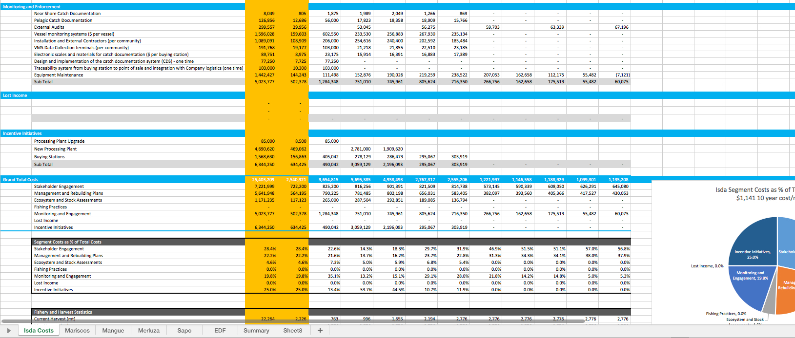
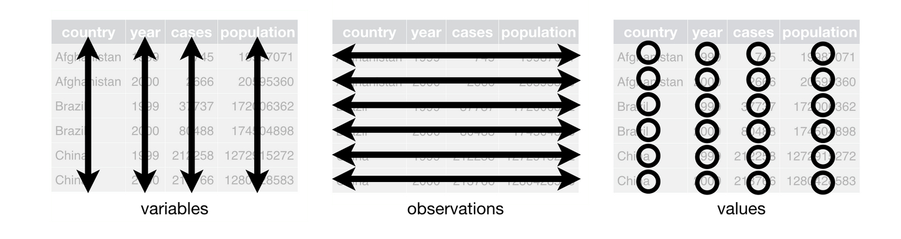
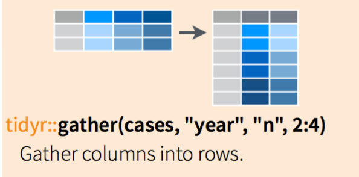

```{r setup, include=FALSE}
knitr::opts_chunk$set(echo = F, message = F, warning = F)
```

```{r, message=F, warning=F, include = F}
library(tidyverse)
library(forcats)
library(stringr)
library(scales)
library(broom)

pres_theme <-theme_bw(base_size = 16, base_family = 'Helvetica')

```


# Estandarización de CPUE

CPUE es una de las métricos mas comunes para estimando el estado de poblaciones de peces. 

La idea claramente es básico: si estas capturando menos pescado con el mismo esfuerzo, probablemente hay menos peses para capturar.

Pero, es útil pensar un poco mas en lo que nos dice CPUE en realidad.

Pensamos en una ecuación básico de captura:

$$ captura = biomasa * esfuerzo * capturabilidad $$

Por ejemplo, si hay 100 peses en un lago (*biomasa*), pesco por una hora con pintado (*esfuerzo*), y tengo una 10% probabilidad de capturar cualquier peses encuentran my carnada sobre la hora (*capturabilidad*), voy a capturar 10 peses. Si le población de peses baja a 50, entonces voy a capturar 5 peses.

Por esta relación, podemos decir que

$$ \frac{capture}{esfuerzo} = biomasa * capturabilidad $$

o mas clara...

$$ CPUE = qB  $$

Entonces si B sube o baja, *CPUE* sube o baja. 

La problema aquí es que si tenemos ańos de *CPUE* datos, y tratamos de inferir el estado de la población (*B*) por la tendencias del *CPUE*.

Se puede ver que si CPUE cambia sobre tiempo, hay dos posibilidades que pueden explicar esto: 

**biomasa esta cambiando o q esta cambiando**

## Ejemplo

```{r CPUE ejemplo, echo=F}

fleets <- data_frame(effort = 10, q = 1, fleet = c('a','b'))

popfun <- function(r = 0.2,K = 1000,effort = 5,q = 0.01,qcreep = 1, years = 20){

  b <-  rep(NA, years)

  qseries <- rep(NA, years)

  catch <- rep(NA, years)

  fleet_a <- rep(NA, years)

  fleet_b <- rep(NA, years)

  b[1] <- K

  qseries[1] <- q

  for (t in 2:years) {
  catch[t - 1] <- b[t - 1] * (effort * qseries[t - 1]  +  effort * q)

  fleet_a[t - 1] <-
  catch[t - 1] * (effort * qseries[t - 1]) / (effort * qseries[t - 1]  +  effort *
  q)

  fleet_b[t - 1] <-
  catch[t - 1] * (effort * q) / (effort * qseries[t - 1]  +  effort * q)

  b[t] <- b[t - 1] + b[t - 1] * r * (1 - b[t - 1] / K) -  catch[t - 1]

  qseries[t] = qseries[t - 1] * qcreep

  }

  out <- data_frame(
  b = b,
  q = qseries,
  r = r,
  K = K,
  catch = catch,
  cpue = catch / effort,
  fleet_a = fleet_a,
  fleet_b = fleet_b,
  year = 1:years,
  effort = effort
  ) %>%
    gather(fleet,fleet_catch, fleet_a, fleet_b) %>%
    mutate(fleet_cpue = fleet_catch/effort, fleet_q = fleet_cpue / b)
  return(out)

}

nocreep <- popfun() %>%
  mutate(creep = 'none')

somecreep <- popfun(qcreep = 1.2) %>%
  mutate(creep = 'some')

cpue_example <- nocreep %>%
  bind_rows(somecreep)


```

Suponga que encontramos una pesquería nuevo.

Queremos monitorear el progreso y sostenibilidad de este pesquería sobre tiempo, y para hacer esto colectamos CPUE sobre tiempo.

Si tecnología es constante, CPUE es una señal perfecto de biomasa

```{r, echo=F}
cpue_example %>%
  filter(creep == 'none') %>%
  group_by(year, creep) %>%
  summarise(biomass = mean(b, na.rm = T), mean_cpue = mean(fleet_cpue, na.rm = T),
            median_cpue = median(fleet_cpue, na.rm = T)) %>%
  gather(metric,value, biomass,mean_cpue) %>%
  group_by(creep, metric) %>%
  mutate(value = value/value[year == 1]) %>%
  ggplot(aes(year,value, color = metric, linetype = metric)) +
  geom_line(size = 1.5) +
  facet_wrap(~creep) +
  scale_y_continuous(name = 'Porcentaje de nivel inicial', labels = percent) + 
  pres_theme
```

En este caso, la abilidad de las flotas son constantes

```{r test, fig.cap="Relacion de CPUE y biomasa con tecnologia constante"}

 cpue_example %>%
  filter(creep == 'none') %>%
  ggplot(aes(year,fleet_q, color = fleet, linetype = fleet)) +
  geom_line(size = 1.5) +
  facet_wrap(~creep) +
  pres_theme

```

Pero, suponga que hay dos flotas, una artesanal y otro comercial. 

Sobre tiempo, la flota artesanal use la misma tecnología. 

Pero, la flota comercial cada año usa un poco de sus ganancias para comprar mejores barcos, mejores redes, etc. 

El resultado, **la flota comercial cada año mejora su capacidad de pesca**


```{r}

 cpue_example %>%
  filter(creep == 'some') %>%
  select(year,fleet_cpue,fleet_q,fleet,creep) %>%
  ggplot(aes(year,fleet_q, color = fleet, linetype = fleet)) +
  geom_line(size = 1.5) +
  facet_wrap(~creep) + 
  pres_theme

```

El resultado de esto es que CPUE ya no es una señal imparcial de biomasa.

Un gerente, mirando solo CPUE, pensarías que biomasa estaba creciendo en los primeros años, y quizás tomara decisiones incorrectos por resultado.

```{r, fig.cap='Dos flotas'}


cpue_example %>%
  group_by(year, creep) %>%
  summarise(biomass = mean(b, na.rm = T), mean_cpue = mean(fleet_cpue, na.rm = T),
            median_cpue = median(fleet_cpue, na.rm = T)) %>%
  gather(metric,value, biomass,mean_cpue) %>%
  group_by(creep, metric) %>%
  mutate(value = value/value[year == 1]) %>%
  ggplot(aes(year,value, color = metric, linetype = metric)) +
  geom_line(size = 1.5) +
  facet_wrap(~creep) +
  scale_y_continuous(name = 'Porcentaje de nivel inicial', labels = percent) + 
  pres_theme


```

Como podemos corregir esto?

## Usando Regresión para Estandarización

El proceso de "estandarización" nos puede ayudar con este problema. 

El objetivo de estandarización es de controlar por factores como tecnología que podrían cesgar CPUE, y sacar la señal verdadero de la población en CPUE.

Suponga que no sabemos exactamente que esta pasando con este cambio de tecnología. 

Pero, sabemos que hay dos flotas, y uno tiene mejor tecnología del otro. 

Podemos controlar por esto, y ver que este proceso mejora nuestro habilidad de usar CPUE pare monitorear biomasa.

```{r}

cpue_example <- cpue_example %>%
  mutate(log_cpue = log(fleet_cpue))

nocreep_reg <- lm(log_cpue ~ factor(year), data = cpue_example %>% filter(creep == 'none'))

creep_reg <- lm(log_cpue ~ factor(year) , data = cpue_example %>% filter(creep == 'some'))

full_creep_reg <- lm(log_cpue ~ factor(year) + fleet, data = cpue_example %>% filter(creep == 'some'))


# summary(nocreep_reg)
#
# summary(creep_reg)
#
# summary(full_creep_reg)


termfun <- function(x) {

  out = as.numeric(paste(x, collapse = ''))

  return(out)
}

  tidy_nocreep <- tidy(nocreep_reg) %>%
  mutate(year_term = str_detect(term,'year')) %>%
  mutate(trans_term = exp(estimate + std.error^2/2)) %>%
  filter(year_term == T) %>%
  mutate(year = str_extract_all(term,'[\\d]', simplify = F),
         year = map_dbl(year,termfun))


  tidy_creep <- tidy(creep_reg) %>%
  mutate(year_term = str_detect(term,'year')) %>%
  mutate(trans_term = exp(estimate + std.error^2/2)) %>%
  filter(year_term == T) %>%
  mutate(year = str_extract_all(term,'[\\d]', simplify = F),
         year = map_dbl(year,termfun))

   tidy_fullcreep <-  tidy(full_creep_reg) %>%
  mutate(year_term = str_detect(term,'year')) %>%
  mutate(trans_term = exp(estimate + std.error^2/2)) %>%
  filter(year_term == T) %>%
  mutate(year = str_extract_all(term,'[\\d]', simplify = F),
         year = map_dbl(year,termfun),
         rel_trans_term = trans_term/trans_term[year == min(year)])

 cpue_example %>%
   filter(creep == 'some') %>%
  group_by(year, creep) %>%
  summarise(biomass = mean(b, na.rm = T), mean_cpue = mean(fleet_cpue, na.rm = T),
            median_cpue = median(fleet_cpue, na.rm = T)) %>%
  gather(metric,value, biomass,mean_cpue) %>%
  group_by(creep, metric) %>%
  mutate(value = value/value[year == 1]) %>%
  ggplot(aes(year,value)) +
  geom_line(size = 1.5, aes(color = metric, linetype = metric)) +
  facet_wrap(~creep) +
  scale_y_continuous(name = 'Porcentaje de nivel inicíal', labels = percent) +
   geom_point(data = tidy_fullcreep, aes(year,rel_trans_term)) + 
   pres_theme


```

Nuestro objetivo por el resto de este ejercicio es aprender como hacer esto nosotros mismos.

# Primeros Pasos: Datos "Tidy" (Ordenado)

Antes de explorar los datos de CPUE, vamos a aprender algunos herramientas para organización y uso de datos.

La caja de herramientas esta contenido en `tidyverse`

```
install.packages('tidyverse')
```

> Científicos de datos, según entrevistas y estimaciones expertos, pasen entre 50%-80% de su tiempo atascado en el trabajo mundano de colectando y preparando datos, antes que puede ser usado para resultados útiles. - [NYTimes (2014)](http://www.nytimes.com/2014/08/18/technology/for-big-data-scientists-hurdle-to-insights-is-janitor-work.html)

El objetivo de los herramientas que vamos a hablar hoy es hacer este proceso mas fácil y rápido.

## Recursos

- [Data wrangling cheatsheet (`dplyr`,`tidyr`)](https://www.rstudio.com/wp-content/uploads/2015/02/data-wrangling-cheatsheet.pdf)
- [ggplot cheatsheet (`ggplot`)](https://www.rstudio.com/wp-content/uploads/2015/03/ggplot2-cheatsheet.pdf)
- [Data wrangling with R and RStudio](https://www.rstudio.com/resources/webinars/data-wrangling-with-r-and-rstudio/)
- [R for Data Science](http://r4ds.had.co.nz/)


Puedes [descargar RStudio](https://www.rstudio.com/products/rstudio/download/) si no lo tienes, o quieres sacar la versión mas reciente `0.99.903` (menu RStudio -> About RStudio), que tiene muchos herramientas útiles.

También, puedes sacar la versión de R mas recién [aquí](https://www.r-project.org/foundation/).

## Porque usar `dplyr` y `tidyr`?
1. **Velocidad**
2. **Legibilidad**
3. **Integración con `ggplot2`**


## Que es "tidy data"?

Esto es en ejemplo clásico de "messy data":

Es útil y claro (mas o menos) para seres humanos

Pero, para una computadora, es muy confuso




## Usando tidy data

Vamos a aprender como usar R para construir datos tidy.

Datos ordenados tienen una filosofía básico:

**Cada columna es un tipo de datos, cada fila es una observación**



Esto no sueno muy complicado, pero es muy poderoso

```{r,echo=T}

peces <- read.csv(file = 'datos para cpue/datos_desordenados.csv', stringsAsFactors = F)

as_data_frame(peces)
```

Que son los problemas con estos datos?

Vamos a usar algunos herramientas tel paquete `dplyr` para resolver esto.

Para empezar, voy a introducir tu nuevo mejor amigo: el "pipe" (tubo) operador

<div class="centered">
 %>%
</div>

El tubo (`%>%`) es como un corredor de relais


La idea is que toma la cosa a la izquierda, y lo pasa a la derecha

Suponga que tenemos una vector de datos `a = c(1,2,3)`

Como obtenemos la suma de `a`?

`sum(a)`

```{r, echo=T}

a <- c(1,2,3)

sum(a)

```

Podemos usar el tubo para esto

```{r, echo=T}

a %>%
  sum()

```

Tenemos `a`, lo pasamos a `%>%`, y `%>%` lo pasa a `sum`

Esto no parece muy útil en este case, pero su poder crece muy rápidamente.

  1. Ayuda mucho con legibilidad
  2. Ayuda con memoria

Retornamos a nuestros datos de peses. Nuestro objetivo es convertirlo a un formato ordenado.

```{r}

peces

```

`tidyr` tiene una función llamado `gather` que nos ayuda aquí.



```{r, echo=T}

gather(peces,especia, captura, contains('pes'))

```

Vemos que `gather` nos ayudo crear un `data_frame` tidy.

Por que es mejor esto?

Podemos hacer este mismo operación usando tubos

```{r, echo = T}

peces %>%
  gather(especia,captura, contains('pes'))

```
Ya que tenemos datos ordenados, podemos hacer operaciones.

Supongo que queremos captura total sobre todos especias en cada año. Como hacemos eso?

`dplyr` nos ayuda también!

```{r}

peces %>%
  gather(especia,captura, contains('pes')) %>%
  group_by(year) %>%
  summarise(captura_total = sum(captura, na.rm = T))

```

Que paso aquí?

`group_by` hace grupos de los datos, y hace operaciones en estos grupos. Podemos agregar por cualquier tipo de datos categóricos

`summarize` hace resúmenes de los datos en cada grupo, usando cualquier operación que quieres.


Suponga que queremos el total y la captura máxima en cada año.

```{r, echo = T}

peces %>%
  gather(especia,captura, contains('pes')) %>%
  group_by(year) %>%
  summarise(captura_total = sum(captura),
            maximo_captura = max(captura))


```

Hay dos tipos generales de operaciones en `dplyr`

`summarise` colapsa datos

`mutate` modifica datos


Suponga que queremos calcular el porcentaje de capturas por cada especia de pes en cada año.

Podemos usar `mutate` para esto

```{r, echo = T}

peces %>%
  gather(especia,captura, contains('pes')) %>%
  group_by(year) %>%
  mutate(captura_annual = sum(captura)) %>%
  arrange(year) %>%
  mutate(porcentaje = captura / captura_annual)

```

Y entonces, suponga que queremos calcular el mínimo porcentaje de algún especia en cada año


```{r}

foo <- function(x,y){

  out = mean(exp(x))

  return(out)
}

 peces %>%
  gather(especia,captura, contains('pes')) %>%
  group_by(year) %>%
  mutate(captura_annual = sum(captura)) %>%
  arrange(year) %>%
  mutate(porcentaje = captura / captura_annual) %>%
  summarise(min_porcentaje = min(porcentaje))

```

Ahora, también tenemos un base de datos de temperatura de agua en cada año

Queremos explorar si algún relación entre capturas y temperatura

Como hacemos eso?

```{r}


walk<-vector(length = length(unique(peces$year)))

  walk[1]<- rnorm(1,0,.75)

  for (i in 2:length(unique(peces$year)))
  {
   walk[i]<-  walk[i - 1] * 1 + rnorm(1,0,0.75)
  }


  water_temp <- data_frame(year = unique(peces$year), temperatura = walk + 18 )

  water_temp %>%
    ggplot(aes(year, temperatura)) +
    geom_point(size = 2)  +
    xlab('Año') +
    ylab('Temperatura') + 
    pres_theme
```

Un opción es usar el mando `left_join`

`left_join` use un clave para identificar observaciones comunes en diferentes bases de datos, y apenda cada observación que tiene un pareja a tu base de datos original.

Miramos

```{r, echo = T}

 peces %>%
  gather(especia,captura, contains('pes')) %>%
  left_join(water_temp, by = 'year')

```

Ahora, podemos investigar nuestro hipótesis que temperatura y captura son correlacionado

```{r, echo = T}

 peces %>%
  gather(especia,captura, contains('pes')) %>%
  left_join(water_temp, by = 'year') %>%
  group_by(year) %>%
  summarise(captura_total = sum(captura),
            temperatura = mean(temperatura)) %>%
  ggplot(aes(captura_total, temperatura)) +
  geom_point() +
  geom_smooth(method = 'lm') +
  geom_hline(aes(yintercept = mean(temperatura))) + pres_theme

```


Estos herramientas son la fundación de código eficiente.

Después de esto, vamos a ver como connector los manipulaciones de `dplyr` con los poderes visuales de `ggplot`

```{r}

capturas <- read_csv(file = 'datos para cpue/capturas.csv')

capturas <- capturas  %>%
  gather(`1950`:`2012`, key = 'year', value = 'capturas') %>%
  mutate(capturas = as.numeric(capturas),
         year = as.numeric(year))

```

## Ejercicios de Datos "Tidy"

* Importe los datos "capturas.csv" usando `read_csv`
* Convierte los datos a un formato "tidy"
* Examine los datos, que tipo de datos son cada columna?
    * Examine los capturas en particular
* Use `mutate` para convertir los capturas a calores numéricos
    * Que paso a los valores de captura?
* Use `group_by` y `summarize` para calcular la captura total en cada año en cada país
* Use otros herramientas para explorar los datos

# Gráficos con `ggplot`

Ya que hemos tenido un introducción rápido a datos "tidy", vamos a ver como podemos visualizar nuestros resultados usando un paquete poderoso llamado `ggplot2`

El "gg" en `ggplot` representa "gramática de gráficos"

Es un formato diseñado para hablar con datos tidy para hacer gráficos buenos, reproducible, y flexible

No hay nada en `ggplot` que no so puede hacer con los herramientas gráficos base de R. Por lo mismo, puedes hacer todos los operaciones de datos tidy en base R también.

Pero, la filosofía de estos paquetes es estandarizar el proceso para hacer lo mas rápido, mas transparente, y mas reproducible.

Empezamos on gráficos de `ggplot`, jugando con los datos de captura que creemos en el ultimo paso.


```{r}
capturas
```

Queremos hacer un gráfico de capturas totales sobre tiempo.

Primero, podemos usar `dplyr` para sacar estos datos

```{r, echo = T}

capturas_por_tiempo <- capturas %>%
  group_by(year) %>%
  summarise(capturas_totales = sum(capturas, na.rm = T))

capturas_por_tiempo
```

Como hacemos este gráfico normalmente?

```{r}

plot(capturas_por_tiempo$year, capturas_por_tiempo$capturas_totales)

```

No hay nada malo con esto. Pero, vamos a ver como hacer esto con `ggplot`

Empezamos creando una cuadra vacía

```{r, echo = T}

ggplot(data = capturas_por_tiempo, aes(x = year, y = capturas_totales))

```

El mando `ggplot` cree nuestro cuadro, donde vamos a pintar con diferentes capas.

Añadimos capas usando el símbolo `+`. Esto nos dice que queremos añadir una capa a nuestro cuadro.

```{r}

ggplot(data = capturas_por_tiempo, aes(x = year, y = capturas_totales)) +
  geom_point()


```

Ya tenemos algo muy similar a lo que tenemos usando `plot`, pero se ve mucho mas confundido!

Empezamos con explicando los compartimientos aquí

`aes` representa estética (aesthetics). Esto es done pones las cosas que quieres dibujar. Puedes ver que esto es lo mismo que `plot(x,y)`

Por que no necesitas usar `$`?

Entonces,

`ggplot(data = capturas_por_tiempo, aes(x = year, y = capturas_totales))`

Dice usa los datos `capturas_por_tiempo`, y hace un gráfico con coordinados `x` de "year" y coordinados `y` de "capturas_totales"

`geom_point` añade una capa de "scatterplot" a nuestro cuadro

`geom_` representa diferentes tipos de capas, por ejemplo

`geom_point` añade una capa de "scatterplot" a nuestro cuadro

`geom_line` añade una capa de linea a nuestro cuadro


```{r, echo = T}

ggplot(data = capturas_por_tiempo, aes(x = year, y = capturas_totales)) +
  geom_point() +
  geom_line() 

```

Esto tiene algunos aventadas sobre gráficos básicos.

Hace tu código mas legible y linear

Pero, a este punto parece mas trabajo que nomas usando `plot`

El poder verdadero empieza com la habilidad de fácilmente visualizar diferentes atributos de los datos.

Supone que queremos hacer el tamaño de los círculos proporcional a la captura total en ese año

```{r, echo = T}

ggplot(data = capturas_por_tiempo, aes(x = year, y = capturas_totales)) +
  geom_point(aes(size = capturas_totales)) +
  geom_line()

```

Y con solo eso, hemos añadido un visualizaron y una leyenda!

`ggplot` interpreta cosas adentro de `aes` como atributos que debe dar leyenda. Puedes usar diferentes tipos de cosas, incluyendo por ejemplo tamaño, color, o forma.

Notas que puse el comanda `size` en el `aes` de `geom_point`

Que pasa si lo pongo en `ggplot`?

```{r}
ggplot(data = capturas_por_tiempo, aes(x = year, y = capturas_totales, size = capturas_totales)) +
  geom_point() +
  geom_line()
```

`aes` adentro de `ggplot` es compartido con todos capas.

`aes` adentro den un `geom_` es solo para ese capa

```{r, echo = T}

ggplot(data = capturas_por_tiempo, aes(x = year, y = capturas_totales, color = capturas_totales)) +
  geom_point() +
  geom_line()
```

Que pasa si ponemos color afuera de `aes`? Esto es como hacemos colores sin asociaciones

```{r, echo = T}

ggplot(data = capturas_por_tiempo, aes(x = year, y = capturas_totales) ) +
  geom_point(color = 'red') +
  geom_line()
```


Todavía hemos nomas asido datos mas claros. Como podemos usar `ggplot` para ver mas información?

Por ejemplo, queremos ver que tipos de especia componen los capturas totales. Regresamos a `dplyr` por un momento

```{r, echo = T}

capturas_por_tiempo <- capturas %>%
  group_by(year, `Tipo de Especia`) %>%
  summarise(capturas_totales = sum(capturas, na.rm = T))

capturas_por_tiempo

```

Que pasa si tratemos de visualizar esto?

```{r, echo=T}

capturas_por_tiempo %>%
  ggplot(aes(year,capturas_totales)) +
  geom_line()
```
Que paso??

Tenemos observaciones para cada especia, podemos visualizar eso por asociando el tipo de especia a un parámetro estético, como color.

```{r, echo = T}

capturas_por_tiempo %>%
  ggplot(aes(year,capturas_totales)) +
  geom_line(aes(color = `Tipo de Especia`))

```

es un poco confuso, pero puedes ver el poder! Para hacerlo mas claro, podemos por ejemplo hacer un `barplot` del ultimo año.

Hay mucho aquí, y hay cursos y libros, pero puedes ver el poder de usando datos "tidy"
con ggplot

```{r, echo = T}

capturas_por_tiempo %>%
  filter(year == max(year)) %>%
  mutate(`Tipo de Especia` = fct_reorder(`Tipo de Especia`,capturas_totales)) %>%
  ggplot(aes(`Tipo de Especia`,capturas_totales)) +
  geom_bar(stat = 'identity', position = 'dodge') +
  coord_flip()

```

## Ejercicios de `ggplot`

1. Examine los datos adentro del base de datos `diamonds`
2. Hace un gráfico usando `plot` de `price` (precio) como un función de `carat` (peso)
3. Hace el mismo gráfico usando `ggplot`
4. Use `ggplot` para hacer los puntos el color rojo
5. Use `ggplot` para hacer los colores representativo a `color`
    * Que nos dice este información?
6. Hace los colores representativo a `color` y el forma representativo de `cut`
7. Juega con diferentes maneras de explorando la relación entre precio y características de los diamantes

# Re-Introducción a Regresión

Ya tenemos algunos herramientas para ayudarnos jugar con datos en R.

Ahora, vamos a ver como podemos usar estos herramientas juntos con regresión para estandarizar CPUE

Para empezar, vamos a explorar regresión en R.

Regresión es una forma de modelo, y hay clases y clases en el tópico, que nosotros vamos a tratar de entender en muy poco tiempo.

Básicamente, una regresión es un modelo de la relación entre diferentes variables.

En teoría:

$$ efecto = causa + error  $$

Mas técnicamente, generalmente hablamos en términos de datos "dependientes" (las cosas que estamos tratando de predecir), y "independientes" (las cosas que usamos para predecir)

$$ dependiente = independiente + error  $$


Vamos a explorar este idea un poco con un base de datos sobre el precio y características de diamantes.


Supone que queremos invertir en diamantes. Vamos a tratar de usar estos datos para entender la relación entre precio de diamantes y sus características usando los datos que exploramos en el ejercicio anterior.


Empezamos con una cosa básico

```{r}
data("diamonds")

diamantes <- diamonds %>%
  as_data_frame() %>%
  rename(depth_perc = depth) %>%
  rename(len = x, width = y, depth = z) %>%
  mutate(cut = factor(cut, ordered = F))

diamantes
```

Vamos a empezar por mirar unas relaciones, empezando con "carats" y precio

```{r}

diamantes %>%
  ggplot(aes(carat, price)) +
  geom_point(aes()) +
  ylab('Precio') +
  scale_y_continuous(labels = dollar) + 
  pres_theme

```

Podemos ver que hay una relación, pero no es perfecto. Como podemos sacar este relación?

En excel, si te recuerdes, puedes poner un "fit line", que nos da cosas como el $R^{2}$ y la pendiente de una linea. Podemos sacar el mismo proceso en R usando la función `lm` (linear model)

`lm` us muy fácil usar

`lm(dependiente ~ independiente, data = datos)`.

Que dice el modelo sobre la relación entre "carat" (peso) y precio?

```{r, echo = T}
r1 <- lm(price ~ carat, data = diamantes)

summary(r1)
```

## Ejercicios de Regresión

* Como interpretamos el coeficiente de `carat`?
* Como interpretamos el `intercept`?
* Como interpretamos el `R-squared`?

## Mas Regresión

Vemos que este modelo
   * nos da una estimación "significante" de la relación entre "carat" y precio.
   * También, vemos que el modelo explica ~`r 100*round(summary(r1)$r.squared,2)`% de la variación de los datos, que es un nivel muy alto: si sabemos los "carats" de un diamante, podemos usar este modelo para hacer un buen estimación de su precio.

Pero, tenemos mas datos, y hay una teoría que dice que debemos incluir todos variables que creemos afectan nuestro variable dependiente. Como podemos usar estos otros variables?

Vemos por ejemplo que tenemos un variable que se llama "cut". Esto nos dice la calidad de la cortada de el diamante. Claramente, esto va a afectar el precio. Pero, como podemos incluir este tipo de datos en una regresión?

```{r}
diamantes
```

R nos deja usar este tipo de cosa, usando un clase de variable que se llama "factores" (factors). Factores son variables que representan grupos. Se puede crear factores de cualquier tipo de cosa, pero generalmente es cosas como, ciudades, país, especia, o en este caso, corte.


```{r, echo=T}

corte <- as.character(diamantes$cut)

head(corte)

```

En este caso, vemos una cuerda normal. Podemos convertir en un factor usando `as.factor`


```{r, echo = T}

head(as.factor(corte))


```

Se ve similar, pero ahora es un factor, con niveles correspondiendo a corta. Es decir, que es data categórico.

Esto es útil por que ahora podemos usarlo en una regresión.

```{r}

r_factor <- lm(price ~ (cut), data = diamantes)

summary(r_factor)

head(diamantes$cut)

```

Que paso a "fair?" Y como podemos usar caracteres como números?

R cree lo que llamamos "dummy variables"

```{r}

a = diag(4) %>% as_data_frame()

colnames(a) <- c('Good','Very Good','Premium','Ideal')

a$cut =  c('Good','Very Good','Premium','Ideal')

a
```

Podemos entonces usar datos numéricos (e.g. carat) y categórico (e.g. cut) en el mismo modelo

```{r, echo = T}

r2 <- lm(price ~ carat + cut, data = diamantes)

summary(r2)

```

Como interpretamos este modelo?

## Usando Regresión

Ahora tenemos este modelo, como podemos usarlo?

Vamos a usar el paquete `broom`

`broom` nos ayuda sacar información importante y útil de una regresión

`summary` nos da mucho información, pero es difícil usar.


Podemos usar `glance` para sacar resumes del modelo

```{r, echo=T}

glance(r2)

```

Podemos usar `tidy` para ver los coeficientes

```{r, echo = T}

tidy(r2)

```
Ahora tenemos coeficientes en una forma mucho mas útil para nosotros.

Como interpretamos los diferentes variables aquí?

Muchas veces, el propósito de un modelo es para hacer predichos Podemos hacer esto con la función `predict`

```{r, echo = T}

head(predict(r2))

```

```{r}
plot(diamantes$price, predict(r2))
```

Otro opción us usar la función `augment` de el paquete `broom`

```{r, echo = T}

augment(r2)

```

Esto es un poco difícil de entender, lo que es mas importante es el variable `.fitted`, que con los valores previsto.

## Diagnósticos

Creando un regresión es facil. Este es bueno pero también tiene riesgos.

Hay cursos y libros en este tópico, y no podemos cubrir todo hoy.

Pero, vamos a ver algunos diagnosticas básicos.

```{r diagnostics}

plot(r2)

```

Y, podemos ver que hay problemas. No indique que no podemos usar este modelo, pero dice que necesitamos investigar las cosas mas.

Para dar otro ejemplo, vamos a ver diagnósticos de otro base de datos sobre flores

```{r counterexample}

r_iris <- lm(Sepal.Length ~  Petal.Length + Petal.Width + Species, data = iris)

summary(r_iris)

plot(r_iris)

```

En este case los diagnósticos son mucho mejor.

# Usando Regresión Para CPUE

Ahora tenemos los herramientas para regresar a nuestro pregunta original: como podemos estandarizar los valores de CPUE para Chita?

Empezamos con los datos

```{r, echo=T}

chita_cpue <- read.csv(file = 'Chita_CPUE_2001_2015.csv', stringsAsFactors = F) %>%
  as_data_frame()

chita_cpue

```

Vemos que no hay un variable llamado CPUE, tenemos que crearlo.

Con los variables que tenemos, que opciones tenemos para definir CPUE?

\n
\n
\n
\n
```{r, echo = T}

chita_cpue <- chita_cpue %>%
  mutate(cpue = Chita_kg / No_Fishers)

```
```{r}

chita_cpue %>% 
  ggplot(aes(cpue)) + 
  geom_histogram(bins = 50) + 
  scale_y_log10() + 
  pres_theme

```

```{r}
chita_cpue %>% 
  ggplot(aes(Year, cpue)) +
  geom_point() + 
  pres_theme
  
```

```{r}
chita_cpue %>% 
  group_by(Year,Gear) %>% 
  summarise(median_cpue = median(cpue, na.rm = T),
            mean_cpue = mean(cpue, na.rm = T)) %>% 
  ggplot(aes(Year, mean_cpue)) +
  geom_line() +
  geom_point() +
  facet_wrap(~Gear, scales = 'free_y') + 
  pres_theme
  
```


```{r}
chita_cpue %>% 
  ggplot(aes(factor(Year), cpue)) +
  geom_boxplot() + 
  scale_y_log10() + 
  pres_theme
  
```


```{r}
chita_cpue %>% 
  group_by(Year) %>% 
  summarise(median_cpue = median(cpue, na.rm = T)) %>% 
  ggplot(aes(Year, median_cpue)) +
  geom_point() + 
  geom_smooth() + 
  pres_theme
  
```
```{r}
chita_cpue %>% 
  group_by(Year) %>% 
  summarise(total_catch = sum(Chita_kg, na.rm = T)) %>% 
  ggplot(aes(Year, total_catch)) +
  geom_point() + 
  geom_smooth() + 
  pres_theme
```

```{r}
chita_cpue %>% 
  group_by(Year) %>% 
  ggplot(aes(factor(Year),fill = Gear)) + 
  geom_bar() +
  pres_theme
```

```{r}

chita_cpue %>% 
  group_by(Year) %>% 
  summarise(num_trips = length(cpue), num_fishers = sum(No_Fishers)) %>% 
  ggplot(aes(Year,num_trips)) + 
  geom_point() + 
  pres_theme

```

```{r}

chita_cpue %>% 
  group_by(Year) %>% 
  summarise(num_trips = length(cpue), num_fishers = sum(No_Fishers)) %>% 
  ggplot(aes(Year,num_fishers)) + 
  geom_point() + 
  pres_theme

```
```{r}

chita_cpue %>% 
  group_by(Year) %>% 
  summarise(num_trips = length(cpue), num_fishers = sum(No_Fishers), mean_hold = mean(Hold_Capacity_kg, na.rm = T)) %>% 
  ggplot(aes(Year,mean_hold)) + 
  geom_point() + 
  pres_theme

```


Y como siempre, graficos!


Vamos a explorar la idea rápidamente aquí, y entonces tratar de hacer esto solo.

Creamos una regresión con variables dependiente `cpue` y variables dependiente `Dist_coast`, `Vessel` y `Gear`. Importantemente, también vamos a incluir el variable `Year`.

`Year` is la cosa mas importante aquí.

Recuerda que la idea de los coeficiente en una regresión es que el coeficiente es el efecto de este variable sobre el variable dependiente **controlando por los otros variables**.

Entonces, esto dice que los coeficientes de `Year` debe ser el efecto de año sobre CPUE, controlando en este caso por cosas como distancia de la costa.

Recuerda que el objetivo de de estandarización is crear una tendencia de abundancia imparcial.

Entonces, podemos interpretar los coeficientes de `Year` como la tendencia de abundancia, controlando para los otros variables.

```{r, echo=T}

cpue_reg <- lm(cpue ~ factor(Year) + Dist_coast + Vessel + Gear, data = chita_cpue)

summary(cpue_reg)

```

Vemos que ya tenemos los coeficientes para `Year`. Terminado?

Vamos a ver algunos de los diagnósticos.

```{r}
plot(cpue_reg)
```

Que esta pasando aquí?

```{r}

cpue_reg %>%
  augment() %>%
  ggplot() +
  geom_vline(aes(xintercept = 0)) +
  geom_histogram(aes(.fitted), bins = 50, alpha = 0.75) + 
  pres_theme

```

```{r}

cpue_reg %>%
  augment() %>%
  ggplot() +
  geom_vline(aes(xintercept = 0)) +
  geom_histogram(aes(.resid), alpha = 0.75) +
  scale_y_log10() + 
  pres_theme

```

Vemos que la distribución no es normal!

Corregimos esto usando logaritmos.

La problema es que datos de CPUE generalmente no son normalmente repartido.

Son lo que llamamos un distribución "log normal"

```{r}

norm_var = rnorm(1000,5,10)

lnorm_var = rlnorm(1000,log(5),1)


 data_frame('normal' = norm_var, 'log normal' = lnorm_var) %>%
  gather('Distribución','value') %>%
  ggplot(aes(value, fill = Distribución)) +
   geom_vline(aes(xintercept = 0)) +
  geom_histogram(color = 'black', bins = 50) +
   facet_grid(`Distribución` ~.) + 
   pres_theme


```

Estos dos distribuciones tienen el mismo promedio, pero se ven muy diferente. Ves que

  * La distribución normal es simétrico, y puede tener valores negativo
  * La distribución log-normal no es simétrico, y no puede tener valores negativo

Mirando la histograma de los "residuals", vemos que se parecen mucho mas "log normal"

Recuerda también que `lm` tiene la suposición que tus datos son normales, y podemos ver que los CPUE's no son.

Podemos resolver esto por suposición los valores de `cpue` a `log(cpue)`

```{r, echo = T}

log_cpue_reg <- lm(log(cpue) ~ factor(Year) + Dist_coast + Vessel + Gear, data = chita_cpue)

```

Vemos los diagnósticos

```{r}
log_cpue_reg %>%
  augment() %>%
  ggplot() +
  geom_vline(aes(xintercept = 0)) +
  geom_histogram(aes(.resid), alpha = 0.75) + 
  pres_theme
```

Mucho mejor!

```{r}
plot(log_cpue_reg)
```

Ahora, podemos usar este modelo para sacar nuestro estandarizado estimaciones de abundancia.

Vamos a hacer esto usando `broom` otra vez.

```{r, echo = T}

coefs <- log_cpue_reg %>%
  tidy()

coefs <- coefs %>%
  bind_cols(confint_tidy(log_cpue_reg))
```

Casi estamos allí

Vemos que tenemos coeficientes para "Year". Como podemos sacar lo?

Podemos usar el mando `filter` (filtro) para sacar filas que contienen "Year"

La cosa difícil aquí es como identificar cuales observaciones contienen "Year"

Podemos hacer esto manualmente. O, podemos usar un mando para encontrar todos estos entradas.

`str_detect` de el paquete `stringr` nos puede ayudar aquí.

```{r, echo = T}

abundancia <- coefs %>%
  filter(str_detect(term,'Year')) %>%
    mutate(year = str_extract_all(term,'[\\d]', simplify = F),
          year = map_dbl(year,termfun)) %>%
  ungroup() %>%
  mutate(trans_est = exp(estimate + std.error^2/2), trans_lower = exp(conf.low + std.error^2/2), trans_upper = exp(conf.high + std.error^2/2 )) %>%
  ungroup() %>%
  mutate(rel_est = trans_est / trans_est[year == min(year)] - 1)

abundancia

```

Tienes que tener precaución con esto y verificar que solo sacaste lo que quieres, pero es un herramienta poderoso.

Ya tenemos indices de "abundancia", relativo a 2001. Estos valores son nuestros indices estandarizado de CPUE.

```{r}

cpue_trend <- chita_cpue %>%
  ungroup() %>%
  group_by(Year) %>%
  summarise(median_cpue = median(cpue, na.rm = T)) %>%
          mutate(  delta_cpue = median_cpue / median_cpue[Year == min(Year) + 1] - 1)


abundancia %>%
  ggplot() +
  geom_pointrange(aes(year,estimate,ymin = conf.low, ymax = conf.high)) +
  ylab('Abundancia') +
  xlab('Año') + 
  pres_theme
```


Hay un paso final, que es un poco difícil explicar, pero es importante.

Los coeficientes que hemos estimado son le relación entre año y log(CPUE).

Tenemos que convertir estos valores a la relación entre año y CPUE.

Hacemos esto por la relación

$$ \beta_{normal} =  exp(\beta_{log} + \frac{\sigma_{\beta}^{2}}{2}) $$

En este case, $\beta$ es los coeficientes de año, y $\sigma$ es el `std.error` sacado por `tidy`

```{r, echo = T}

abundancia %>%
  select(term, estimate, std.error,trans_est)


```

```{r, echo = T}
abundancia %>%
  mutate(year = str_extract_all(term,'[\\d]', simplify = F),
          year = map_dbl(year,termfun)) %>%
  ggplot() +
  geom_pointrange(aes(year,trans_est,ymin = trans_lower, ymax = trans_upper)) +
  ylab('Abundancia') +
  xlab('Año') + 
  pres_theme
```

```{r}

abundancia %>%
  mutate(year = str_extract_all(term,'[\\d]', simplify = F),
          year = map_dbl(year,termfun)) %>%
  ggplot() +
  geom_line(aes(year,rel_est, color = 'Estandarizado'), size = 2) +
  geom_point( data = cpue_trend, aes(Year,delta_cpue, color = 'Observado'), size = 2) +
  ylab('Abundancia') +
  xlab('Año') +
  scale_fill_discrete(name = 'Fuente') + 
  pres_theme


```

Y por fin! Tenemos un indice de abundancia estandarizado.

Se que eso fue mucho... En resumen

  1. Explorar tus datos
  2. Calcula CPUE
  3. Escoge tus variables independientes (los de la mano derecha), **siempre incluyendo tiempo como un variable fijo**
  4. Convertir CPUE a log(CPUE)
  5. use `lm` o otro función para crear un regresión de `log(cpue) ~ variables dependientes`
  6. Examine los diagnosticas de la regresión usando `plot`
  7. Si todo parece mas o menos bien, continua. Si parece raro, encuentra un estadístico
  8. Saca los coeficientes de tiempo (e.g. año)
  9. Convertir a unidades normales por la formula anterior
  10. Mira la tendencia generado
  11. Trata otro modelos, compara resultados, discutir

# Ejercicios Finales

  1. Importa los datos de CPUE
  2. Escoge como quieres calcular CPUE
  3. Hace resumes, gráficos y tablas, de variables de interés
  4. Use tus variables escogido en un regresión
  5. Interpretar todos los diferentes coeficiente
      * Tienen sentido lógico?
  6. Saca los indices de abundancias estandarizado
  7. Hace gráficos de los resultados
  8. Construye por lo menos un modelo alternativo (usando otros variables independientes)
  9. Compare los resultados
  
  
```{r, echo=T}

dat <- read_csv(file = "chita_data/Daily Catch_Effort (Anisotermus scapularis) PERU 2001-2015.csv")

dat

```
